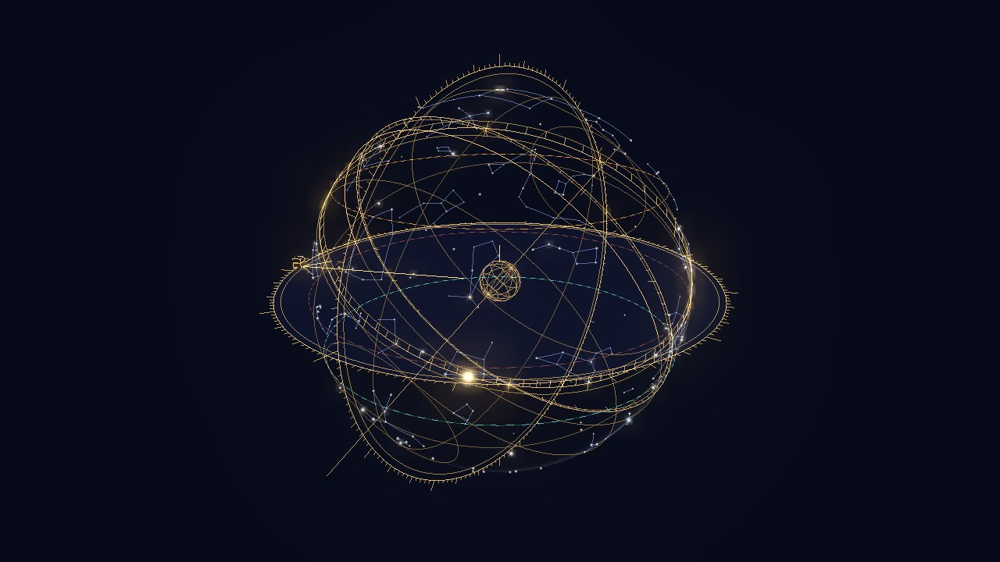
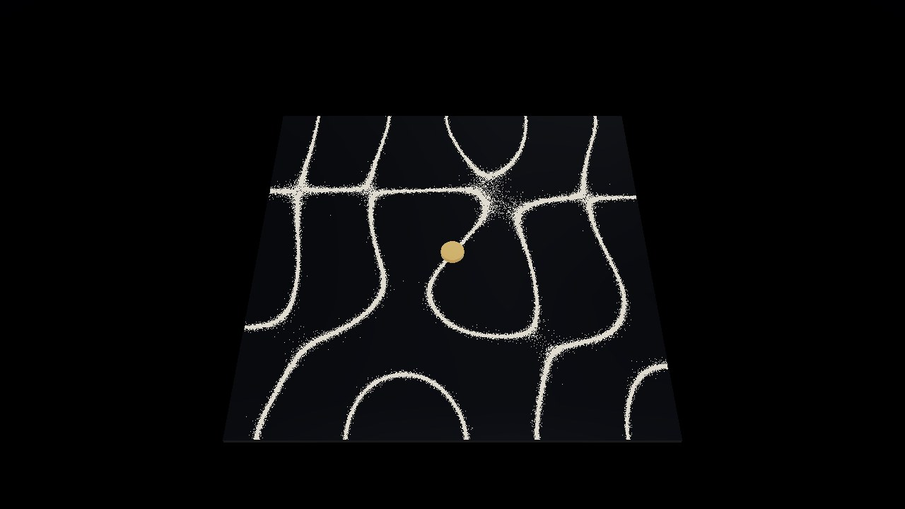
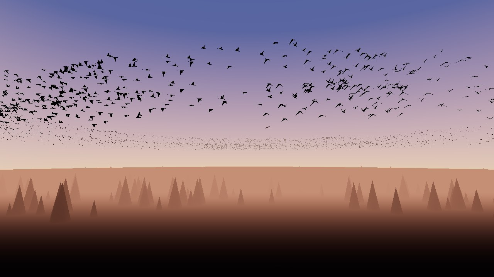
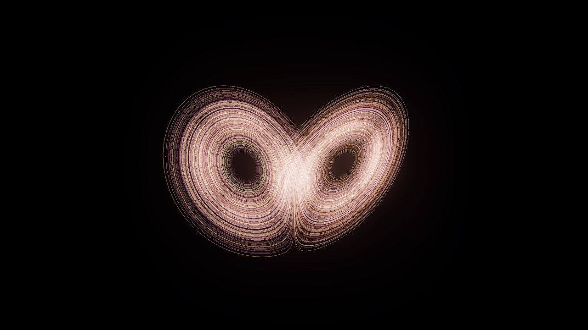
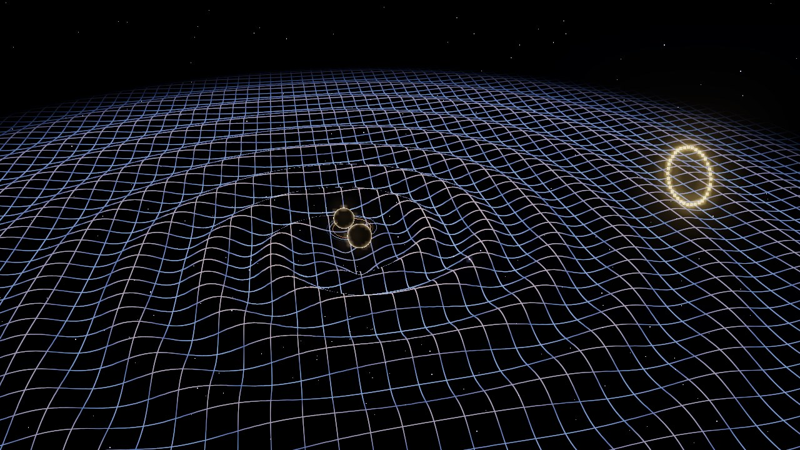
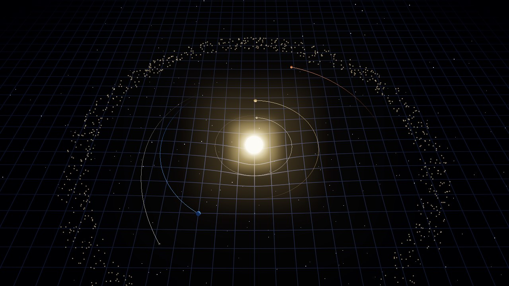
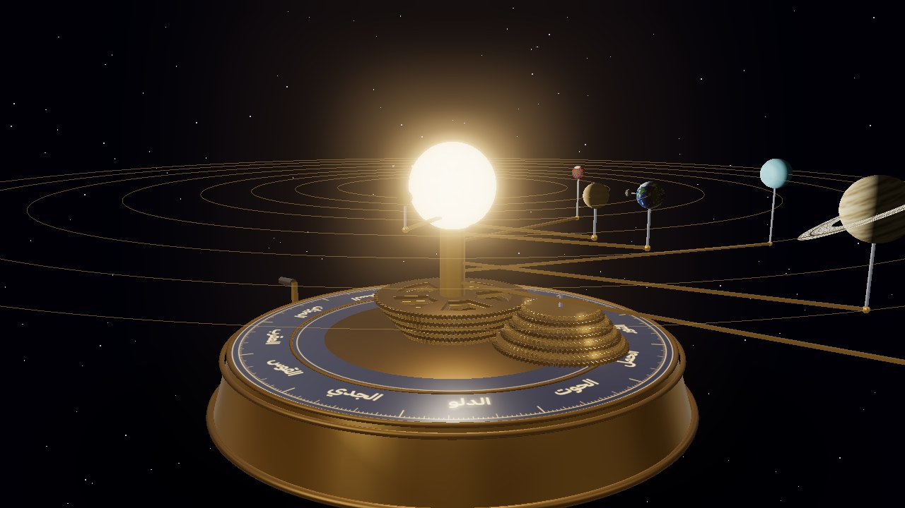
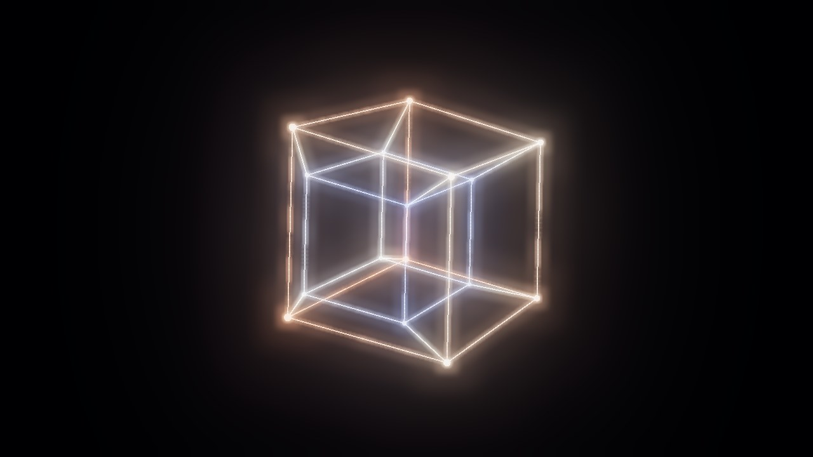

<div dir="rtl">

# مَرصَد

إحدى عشرة تجربة علمية ثلاثية الأبعاد تُحسب لحظة بلحظة على كرت الشاشة، داخل المتصفح. لا صور ولا فيديو: كل ما تراه يخرج من معادلات الفيزياء والرياضيات، وتستطيع أن تغيّرها بيدك.

**جرّبه مباشرة:** [zed12g6t.github.io/marsad](https://zed12g6t.github.io/marsad/)



## المعروضات

مرتّبة من الأصغر إلى الأكبر:

| المقياس | التجربة | ما الذي يحدث فيها |
|---|---|---|
| 10⁻¹⁰ م | [ذرة الهيدروجين](exhibits/atom/) | مدارات الإلكترون من حل معادلة شرودنغر، ملوّنة حسب طور الموجة. تراكب حالتين يجعل السحابة تتأرجح، ويُحسب طول موجة الضوء المنبعث (مثل خط Hα الأحمر ٦٥٦ نانومتراً). |
| 10⁻¹ م | [لوحة كلادني](exhibits/chladni/) | رمل على لوح مربع يهتز، يُحسب على كرت الشاشة ويهرب من البطون إلى الخطوط العقدية. أنماط اللوح من تراكب الأنماط الذاتية مع رنين حقيقي حول كل تردد، وتسمع النغمة نفسها. |
| 10² م | [سرب الطيور](exhibits/flock/) | خوارزمية «بويدز» لكريغ رينولدز مع قاعدة الجيران السبعة التي رُصدت في أسراب الزرازير، وتقسيم مكاني يجعلها تكفي آلاف الطيور. صقر يطارد السرب فتنتشر موجات الهروب. |
| 10⁴ م | [الفوضى](exhibits/chaos/) | ثمانية جواذب غريبة (لورنز وأيزاوا وتوماس وغيرها) بطريقة رونغه–كوتا. مئات الخيوط تتبع الجاذب، ووضع «أثر الفراشة» يطلق مسارين بينهما جزء من مئة مليون ويقيس افتراقهما. |
| 10⁵ م | [موجات الجاذبية](exhibits/waves/) | ثقبان أسودان يقتربان حسب قانون الزقزقة، والموجات تُرسم على الزمكان من تاريخ المدار عند الزمن المتأخر. صوت الزقزقة ورسم مثل ما التقطه LIGO في GW150914. |
| 10⁷ م | [ذات الحلق](exhibits/armillary/) | كرة سماوية نحاسية بنحو ٢٣٠ نجماً بأسمائها العربية وكوكبات الصوفي. أوقات الصلاة بتقويم أم القرى من موضع الشمس، واتجاه القبلة، والدخول إلى قلب الكرة، وتحوّلها إلى أسطرلاب بالإسقاط المجسامي تستخدمه بيدك. |
| 10¹⁰ م | [الثقب الأسود](exhibits/black-hole/) | تتبّع أشعة الضوء على مسارات شفارتزشيلد، قرص تراكم بحرارة نوفيكوف–ثورن، تأثير دوبلر النسبي والانزياح الأحمر الجاذبي، وحساب تباطؤ الزمن عند موقعك. |
| 10¹¹ م | [ساحة الجاذبية](exhibits/gravity/) | محاكاة أجسام متعددة بطريقة فيرليه، ترمي فيها النجوم والكواكب وترى مسارها المتوقع. مدار الثمانية لشنسينر ومونتغمري، ونقاط لاغرانج، وعدّاد لحفظ الطاقة. |
| 10¹³ م | [المجموعة الشمسية](exhibits/orrery/) | آلة «أوري» نحاسية بتروس، والكواكب في مواقعها الحقيقية من عناصر مدارات JPL وحل معادلة كبلر. مقبض تديره بيدك، وخط نظر إلى المريخ يكشف حركته التراجعية. |
| 10²¹ م | [تصادم مجرتين](exhibits/galaxies/) | حتى مليون نجمة تتحرك على كرت الشاشة (GPGPU) في جاذبية مجرتين بهالات مادة مظلمة واحتكاك ديناميكي. أربعة سيناريوهات منها عجلة العربة والهوائيات. |
| ∞ | [البعد الرابع](exhibits/fourd/) | المجسمات الرباعية المنتظمة كلها، من المكعب الرباعي إلى ذي الستمئة خلية، بإسقاط منظوري أو مجسامي ودوران في المستويات الستة. شرائح ثلاثية الأبعاد، وطارة كليفورد، وتليّف هوبف. |

| | |
|---|---|
|  |  |
|  |  |
|  |  |
|  |  |
|  |  |

## تفاصيل تقنية

- **بلا أدوات بناء:** HTML و CSS و JavaScript (ES modules) مع [three.js](https://threejs.org) r160 من CDN. الشيدرات مكتوبة يدوياً بـ GLSL.
- **دقة متكيّفة:** كل تجربة تقيس سرعة الإطارات وتخفض دقة الرسم الداخلية أو ترفعها لتبقى ناعمة على أي جهاز، ويمكن اختيار الجودة يدوياً.
- **الصوت:** لوحة كلادني وموجات الجاذبية تولّدان صوتهما بـ Web Audio، ولا يبدأ الصوت إلا بضغطة منك.
- **الواجهة عربية بالكامل** (RTL) بخط IBM Plex Sans Arabic، وفي كل تجربة شرح علمي مبسّط.
- اضغط <kbd>H</kbd> داخل أي تجربة لإخفاء الواجهة.

## التشغيل محلياً

الصفحات تستخدم ES modules، فتحتاج خادماً بسيطاً بدل فتح الملف مباشرة:

```bash
npx serve .
```

أو:

```bash
python -m http.server 8000
```

ثم افتح `http://localhost:8000`. تحتاج متصفحاً يدعم WebGL2 (كروم أو إيدج أو فايرفوكس أو سفاري حديث).

</div>
