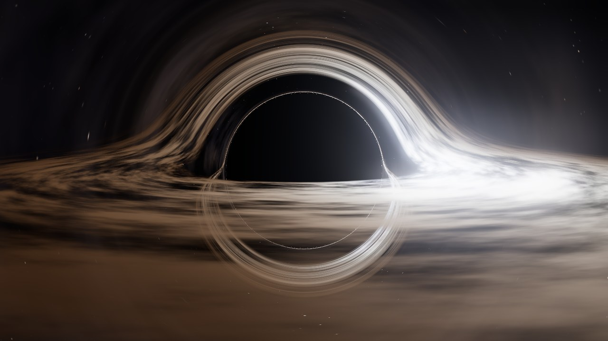
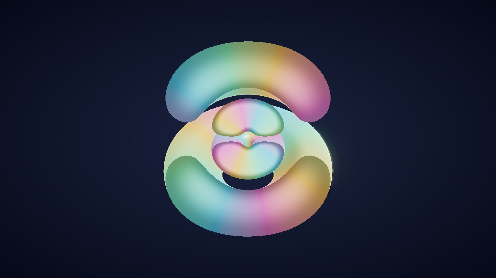
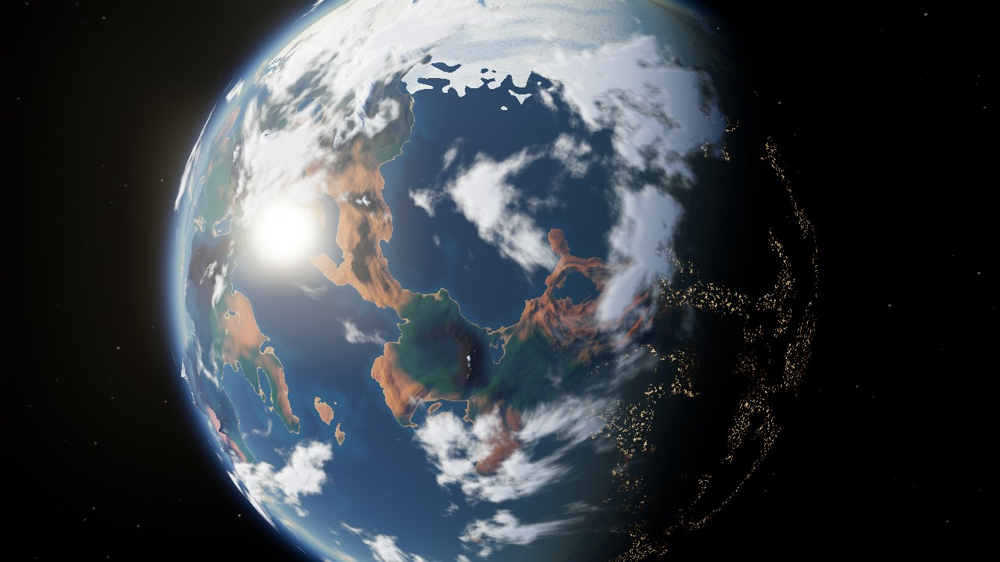
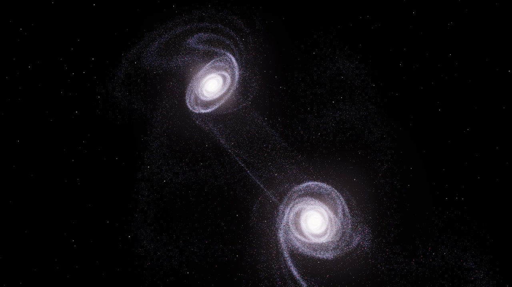
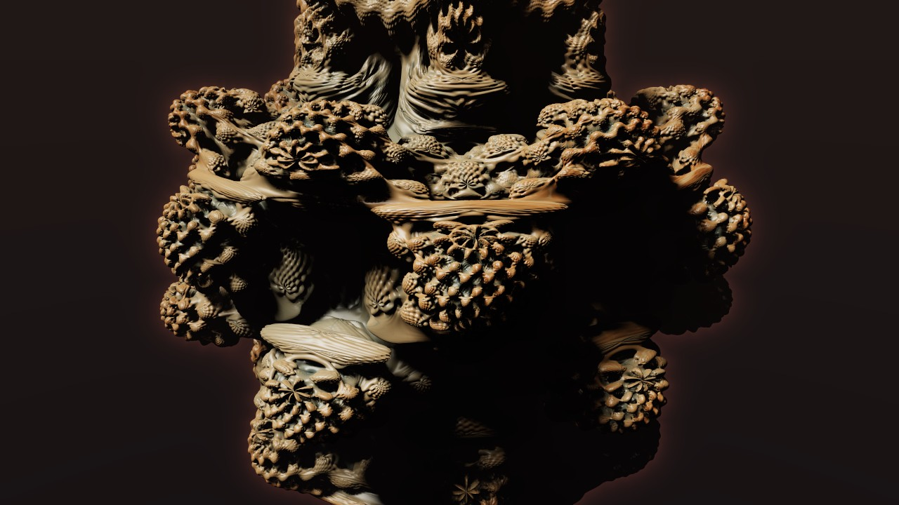

<div dir="rtl">

# مَرصَد

خمس تجارب علمية ثلاثية الأبعاد تُحسب لحظة بلحظة على كرت الشاشة، داخل المتصفح. لا صور ولا فيديو: كل ما تراه يخرج من معادلات الفيزياء والرياضيات، وتستطيع أن تغيّرها بيدك.

**جرّبه مباشرة:** LIVE_URL



## المعروضات

مرتّبة من الأصغر إلى الأكبر:

| المقياس | التجربة | ما الذي يحدث فيها |
|---|---|---|
| 10⁻¹⁰ م | [ذرة الهيدروجين](exhibits/atom/) | مدارات الإلكترون من حل معادلة شرودنغر، ملوّنة حسب طور الموجة. تراكب حالتين يجعل السحابة تتأرجح، ويُحسب طول موجة الضوء المنبعث (مثل خط Hα الأحمر ٦٥٦ نانومتراً). |
| 10⁷ م | [كوكب من العدم](exhibits/planet/) | تضاريس من ضوضاء بيرلن تُخبز في خريطة مكعبة، محيطات بانعكاس الشمس، غيوم متحركة، وغلاف جوي بتشتت رايلي ومي. ستة أنواع كواكب (منها البركاني والغريب)، وهبوط سينمائي عند الغروب. |
| 10¹⁰ م | [الثقب الأسود](exhibits/black-hole/) | تتبّع أشعة الضوء على مسارات شفارتزشيلد، قرص تراكم بحرارة نوفيكوف–ثورن، تأثير دوبلر النسبي والانزياح الأحمر الجاذبي، وحساب تباطؤ الزمن عند موقعك. |
| 10²¹ م | [تصادم مجرتين](exhibits/galaxies/) | حتى مليون نجمة تتحرك على كرت الشاشة (GPGPU) في جاذبية مجرتين بهالات مادة مظلمة واحتكاك ديناميكي. أربعة سيناريوهات منها عجلة العربة والهوائيات. |
| ∞ | [فراكتل لا ينتهي](exhibits/fractal/) | مندلبلب ومندلبوكس وجوليا رباعية بالـ ray marching، مع ظلال ناعمة وإضاءة محيطة، وتنعيم تراكمي حين تتوقف الكاميرا. انقر مرتين على أي نقطة لتنغمس فيها. |

| | |
|---|---|
|  |  |
|  |  |

## تفاصيل تقنية

- **بلا أدوات بناء:** HTML و CSS و JavaScript (ES modules) مع [three.js](https://threejs.org) r160 من CDN. الشيدرات مكتوبة يدوياً بـ GLSL.
- **دقة متكيّفة:** كل تجربة تقيس سرعة الإطارات وتخفض دقة الرسم الداخلية أو ترفعها لتبقى ناعمة على أي جهاز، ويمكن اختيار الجودة يدوياً.
- **الواجهة عربية بالكامل** (RTL)، بخطّي ريم كوفي ونوتو نسخ، وفي كل تجربة شرح علمي مبسّط.
- اضغط <kbd>H</kbd> داخل أي تجربة لإخفاء الواجهة.

## التشغيل محلياً

الصفحات تستخدم ES modules، فتحتاج خادماً بسيطاً بدل فتح الملف مباشرة:

```bash
npx serve .
```

أو:

```bash
python -m http.server 8000
```

ثم افتح `http://localhost:8000`. تحتاج متصفحاً يدعم WebGL2 (كروم أو إيدج أو فايرفوكس أو سفاري حديث).

</div>
